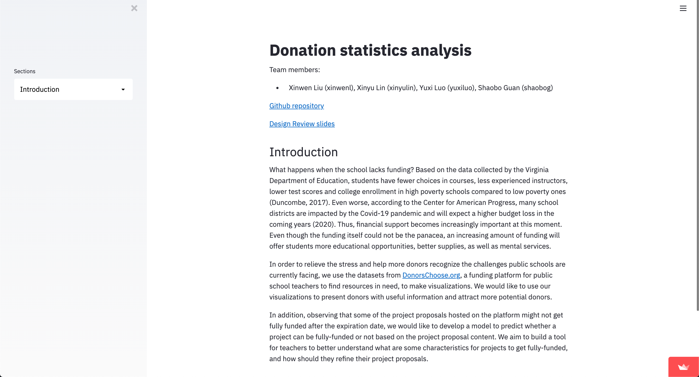
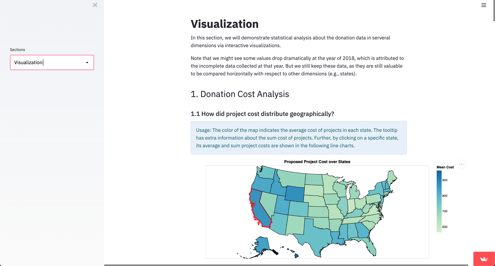
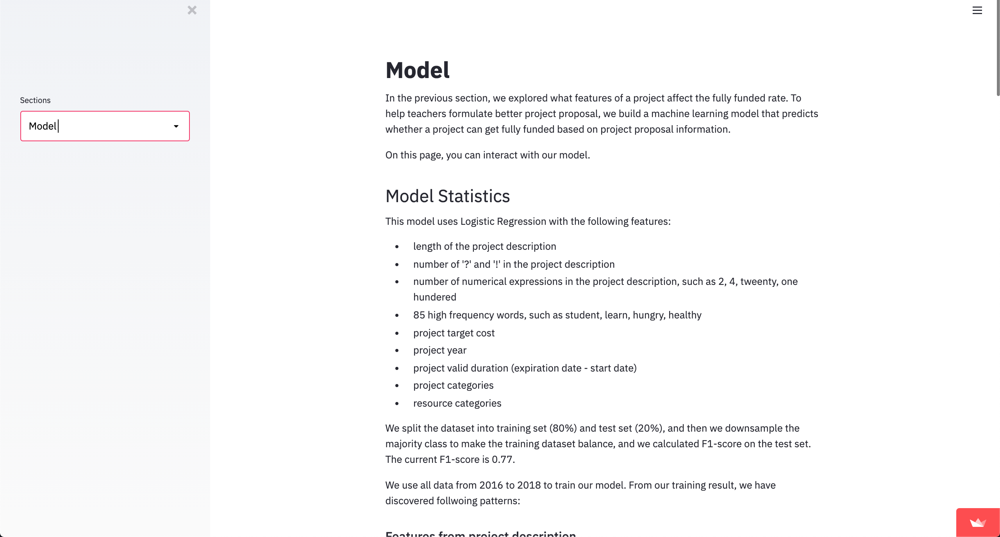

# CMU Interactive Data Science Final Project [](https://share.streamlit.io/cmu-ids-2020/fp-vectorization/main)

* **Online URL**: https://share.streamlit.io/cmu-ids-2020/fp-vectorization/main
* **Team members**:
  * Contact person: yuxiluo@andrew.cmu.edu (Yuxi Luo)
  * shaobog@andrew.cmu.edu (Shaobo Guan)
  * xinyulin@andrew.cmu.edu (Xinyu Lin)
  * xinwenl@andrew.cmu.edu (Xinwen Liu)
* **Track**: Narrative

## Work distribution

Team:

- Weekly 2-hr meetings to brainstorm, discuss current progress and future work
- Completion of project description and required documents (Project Proposal, Video, and Final Report)

Yuxi Luo

- Model: feature extraction, weights visualization, model interaction (Predicting if Your Project can be Fully-funded)

Xinwen Liu:

- Model: feature extraction, model training, model interaction (Does the Model Agree with You?)

Shaobo Guan

- Visualization: data aggregation, visualization plotting

Xinyu Lin

- Visualization: narration, visualization ideas

## Project Title

- Donation Statistics Analysis

## Summary Image





## Abstract

With a Narrative track for this final project, our team will analyze the donation statistics from [DonorsChoose.org](http://DonorsChoose.org), a funding platform for public school teachers to find resources in need, to make visualizations. Our essential question is: what is the current state of funding for public schools. We learn that public schools need more funding to provide quality education that will play an important role in students’ learning outcomes. We would like to help users and potential donors understand the challenges that public schools face and what their needs are.

First, we will present a number of visualizations to provide useful information about the donation statistics over the past years, and help future donors to explore the options to make contributions for public education on their end. The visualizations will generally introduce two aspects of the data: Donation Cost Analysis for all donations, and Successful Rate Analysis for the project proposals hosted on the platform.

Second, based on our observation, a large number of projects are not fully-funded at the end. Therefore, we want to build a model to predict whether a project can be fully funded or not, to allow teachers to better understand what are some characteristics for projects to get fully-funded, and how they should refine their project proposals. In addition, we provide two interactive components to help users better understand our proposed model, in which they can explore the model's responses


## Links

- [Paper](./documents/Report.pdf)
- [Video](https://drive.google.com/file/d/1Mi2zYTQxJhcHAJW0ulg_B2-tZ2nV042W/view?usp=sharing)
- [Application](https://share.streamlit.io/cmu-ids-2020/fp-vectorization/main)


## Running Instructions for the Software

```
$ streamlit run streamlit_app.py
```


-------------------------------------

## Deliverables

### Proposal

- [x] The URL at the top of this readme needs to point to your application online. It should also list the names of the team members.
- [x] A completed proposal. The contact should submit it as a PDF on Canvas.

### Design review

- [x] Develop a prototype of your project.
- [x] Create a 5 minute video to demonstrate your project and lists any question you have for the course staff. The contact should submit the video on Canvas.

### Final deliverables

- [x] All code for the project should be in the repo.
- [x] A 5 minute video demonstration.
- [x] Update Readme according to Canvas instructions.
- [x] A detailed project report. The contact should submit the video and report as a PDF on Canvas.
